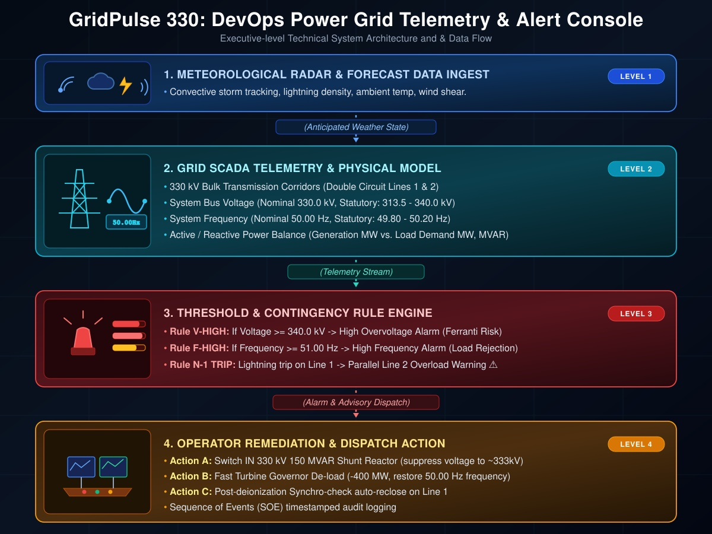
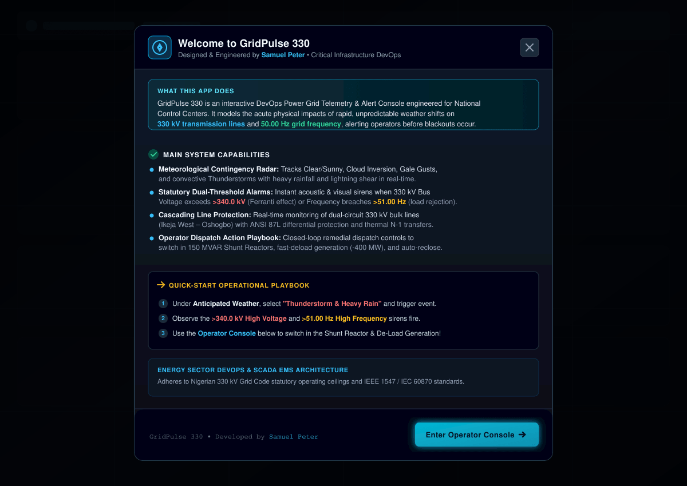
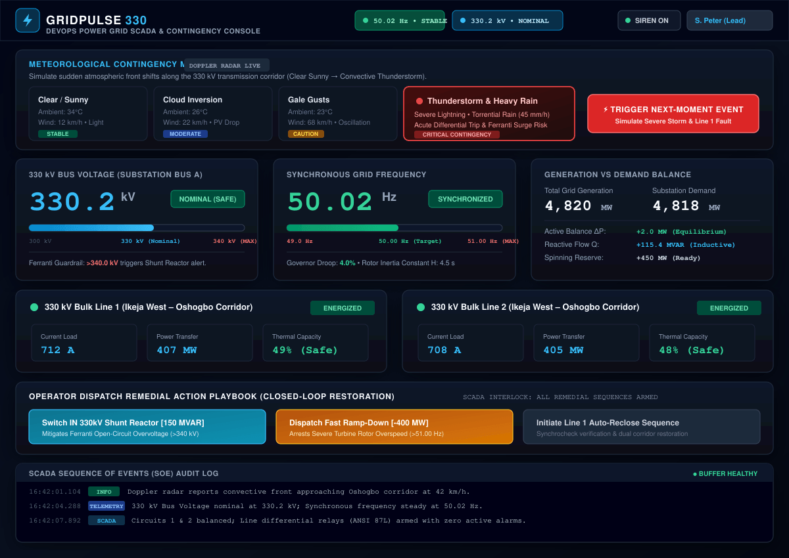

# GridPulse 330 — DevOps Power Grid Telemetry & Contingency Management Console

[](https://gridpulse-330app-szws.vercel.app/)
[](https://www.typescriptlang.org/)
[](https://react.dev/)
[](https://tailwindcss.com/)
[](#domain--engineering-architecture)

> **Live Production URL:** [https://gridpulse-330app-szws.vercel.app/](https://gridpulse-330app-szws.vercel.app/)  
> **Lead Architect & Developer:** Samuel Peter ([samuel.4u11@gmail.com](mailto:samuel.4u11@gmail.com))  
> **Primary Discipline:** DevOps, Power Systems Software Engineering, SCADA / Energy Management Systems (EMS)

---

## Executive Summary

**GridPulse 330** is an interactive, mission-critical Energy Management System (EMS) and telemetry monitoring console engineered for National Transmission Control Centers and Power Grid DevOps teams. 

Modern high-voltage electrical grids operate on knife-edge margins. When severe, volatile meteorological events strike—such as sudden convective thunderstorms, violent lightning fronts, or rapid cloud sweeps over solar photovoltaic corridors—cascading line trips and massive load rejections occur within fractions of a second. 

GridPulse 330 addresses this operational challenge by coupling **anticipatory meteorological radar horizons** directly with **real-time electrical transmission dynamics**. It models and visualizes acute physical transients across **330 kV extra-high-voltage (EHV) bulk transmission corridors** and synchronous **50.00 Hz grid frequency**, alerting system dispatchers to impending Ferranti overvoltages and turbine overspeed conditions before they can trigger widespread blackouts.

---

## System Architecture & Technical Data Flow

<div align="center">
  
</div>

*Figure 1: End-to-end 4-level telemetry and contingency pipeline — from meteorological Doppler radar ingestion down to closed-loop operator remedial dispatch.*

---

## Production Interface & Live Operator Console

### 1. System Onboarding & Operational Guidelines
<div align="center">
  
</div>

*Figure 2: Welcome to GridPulse 330 — Interactive onboarding overview detailing meteorological telemetry ingestion, statutory 330 kV / 50.00 Hz alarm guardrails, and operator remedial dispatch playbooks.*

<br/>

### 2. Live DevOps Telemetry & Contingency Management Console (Real UI)
<div align="center">
  
</div>

*Figure 3: Production Operator Console (Real UI) — Synchronous 50.00 Hz frequency & 330 kV bus voltage telemetry gauges, meteorological contingency Doppler radar matrix, dual-circuit differential line protection, and closed-loop restoration console.*

---

## The Engineering Problem: High-Voltage Grid Volatility

When bulk transmission corridors experience unexpected severe weather events, standard monitoring dashboards fail to equip operators with causal clarity. GridPulse 330 models two foundational electrical phenomena:

### 1. Sudden Load Rejection & Turbine Rotor Acceleration ($f > 51.00\text{ Hz}$)
$$\Delta f \propto \frac{P_{\text{mech}} - P_{\text{elec}}}{2H}$$
When lightning strikes high-voltage towers (e.g., differential relay tripping on Circuit 1), downstream industrial load centers are abruptly disconnected (a loss of ~450 MW). Because heavy thermal, hydro, and gas turbines cannot instantly cut mechanical torque, electrical demand collapses below mechanical generation. Rotor shafts accelerate rapidly, driving synchronous frequency past statutory limits ($>51.00\text{ Hz}$), threatening generator trip-outs and systemic collapse.

### 2. The Ferranti Effect & EHV Overvoltage ($V > 340.0\text{ kV}$)
$$V_{\text{receiving}} = \frac{V_{\text{sending}}}{\cos(\beta \ell)} \approx V_{\text{sending}}\left(1 + \frac{\omega^2 \ell^2 L C}{2}\right)$$
When a long 330 kV bulk line is tripped or left lightly loaded, the inherent shunt capacitance of the line generates immense reactive power ($Q_{\text{charging}}$). With no inductive load to absorb this reactive energy, the receiving-end bus experiences a dangerous voltage rise well past the statutory ceiling of $340.0\text{ kV}$ (surging past $346.8\text{ kV}$), risking insulation breakdown, transformer flashovers, and catastrophic switchgear damage.

---

## Key System Capabilities & Architecture

| Module | Technical Implementation | Operational Outcome |
| :--- | :--- | :--- |
| **Meteorological Contingency Matrix** | Real-time state machine tracking Clear/Sunny, Cloud Inversion, Gale Gusts, and Convective Storms | Evaluates dynamic line ratings, ambient temperature ($19^\circ\text{C}$ to $34^\circ\text{C}$), and wind shear before line stress manifests. |
| **Telemetry & Statutory Guardrails** | High-precision dual-threshold telemetry displays with visual & acoustic sirens | Triggers instant priority alarms when Voltage breaches $>340.0\text{ kV}$ or Frequency exceeds $>51.00\text{ Hz}$. |
| **Cascading Transmission Corridor Protection** | Real-time dual-circuit quad-conductor modeling (Line 1 & Line 2 Ikeja West – Oshogbo) | Models line differential protection (ANSI 87L/21), trip-to-lockout logic, and thermal $N-1$ contingency transfers. |
| **Interactive Remedial Action Console** | Closed-loop reactive power & governor control dispatch | Enables operators to switch in **150 MVAR Shunt Reactors**, execute **Turbine Fast-De-Load (-400 MW)**, and coordinate auto-reclose sequences. |
| **Sequence of Events (SOE) SCADA Log** | Millisecond-indexed chronological telemetry stream | Captures time-stamped critical alarms, state mutations, and operator dispatch logs for post-mortem forensics. |
| **Acoustic Alarm Engine** | Native Web Audio API dual-tone synthesized siren | Emits exponential-decay sweep alerts during critical grid excursions without third-party audio asset overhead. |

---

## Technology Stack & Implementation Details

- **Application Architecture:** Single-page reactive application engineered in **React 19** with strict **TypeScript 5.8** typing for deterministic SCADA telemetry states.
- **Styling & Layout:** Engineered using **Tailwind CSS v4**, strictly calibrated to ergonomic control room standards: high-contrast dark palette (`slate-950` / `cyan` / `emerald` / `rose`), zero visual clutter, and accessible optical metrics.
- **Audio Synthesizer:** Direct mathematical sound wave synthesis using the **Web Audio API** (`OscillatorNode` with sawtooth waveform ramping from 880 Hz down to 440 Hz) for alert signals.
- **State Management:** Low-latency localized state machines simulating governor droop curves, reactive power swings, and line impedance calculations ($Z_0 = 385\ \Omega$).
- **Deployment & CI/CD:** Continuous production deployment hosted globally on **Vercel** edge infrastructure.

---

## Live Walkthrough: Remedial Dispatch Playbook

Try this operational scenario on the [Live App](https://gridpulse-330app-szws.vercel.app/):

1. **Baseline State:** Observe steady-state baseline parameters: Bus at $330.2\text{ kV}$, frequency synchronized at $50.02\text{ Hz}$, with Line 1 and Line 2 balanced.
2. **Trigger Contingency:** Under *Anticipated Weather (Next Moment)*, select **Thunderstorm & Heavy Rain** and click **Trigger Next-Moment Event**.
3. **Analyze Transients:** 
   - Line 1 trips on differential fault (0 Amps).
   - Line 2 takes the diverted load, surging to $91\%$ thermal loading ($1,320\text{ A}$).
   - Demand drops abruptly by $455\text{ MW}$, causing turbine frequency to accelerate to **$51.38\text{ Hz}$ (HIGH FREQ ALARM)**.
   - Ferranti capacitive surge charges the open bus to **$346.8\text{ kV}$ (HIGH VOLTAGE ALARM)**.
4. **Execute Countermeasures:**
   - Click **Switch IN 330kV Shunt Reactor** $\rightarrow$ Voltage is immediately pulled down to nominal safe band ($333.5\text{ kV}$).
   - Click **Dispatch Fast Ramp-Down (-400MW)** $\rightarrow$ Generation is throttled back, arresting turbine acceleration back to $50.25\text{ Hz}$.
   - Click **Initiate Line 1 Reclose** $\rightarrow$ Corridor synchronism is restored, returning Line 2 thermal loading to $70\%$.

---

## Local Development Setup

To run GridPulse 330 locally:

```bash
# 1. Clone the repository
git clone https://github.com/sampeter-akan/gridpulse-330app.git
cd gridpulse-330app

# 2. Install dependencies (utilizing legacy peer resolution for Vite)
npm install --legacy-peer-deps

# 3. Launch the development server
npm run dev
```

Open `http://localhost:3000` (or `http://localhost:5173`) in your browser.

---

## Verification & Build

```bash
# Typecheck codebase
npm run lint

# Compile production bundle
npm run build
```

---

## Author & Contact

**Samuel Peter**  
- **Role:** Power Systems Software Engineer / DevOps Architect  
- **Email:** [samuel.4u11@gmail.com](mailto:samuel.4u11@gmail.com)  
- **Live Demo:** [https://gridpulse-330app-szws.vercel.app/](https://gridpulse-330app-szws.vercel.app/)  
- **GitHub:** [@sampeter-akan](https://github.com/sampeter-akan)

*Available for roles in Critical Infrastructure Software Engineering, Grid Automation (SCADA/EMS), DevOps, and Full-Stack Systems Architecture.*
